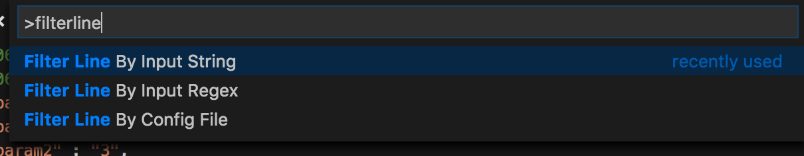
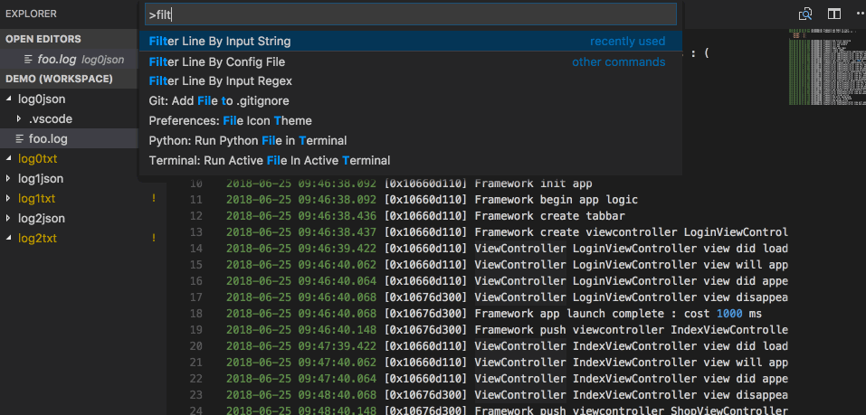
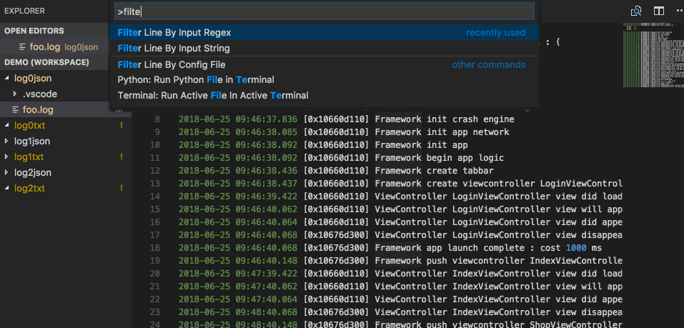
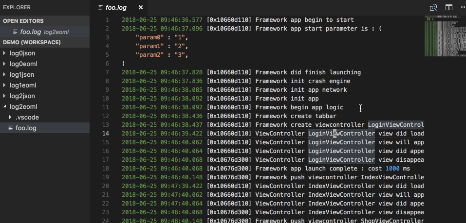

# VSCode Extension Filter Line

Filter line for current opening file by strings/regular expressions, generating the result in a new file.

## Features

1. Filter line by input string.
2. Filter line by input regular expression.
3. Filter line by config file `filterline.json`(or `filterline.eoml`) in corresponding `.vscode` directory.

## Usage

### Filter line by input string.

1. Open command palette (⇧⌘p) and type `filterline`, select `Filter Line By Input String` in the list.
2. Type a string and hit `<Enter>`.
3. The extension will output matching lines in a new file with postfix `.filterline.$(ext)` (e.g. `1.log` will generate file `1.log.filterline.log`).

### Filter line by input regex.

1. Open Command Palette (⇧⌘P) and type `FilterLine`, select `Filter Line By Input Regex` in the list.
2. Type a regular expression and hit `<Enter>`.
3. The extension will output matching lines in a new file with postfix `.filterline.$(ext)` (e.g. `1.log` will generate file `1.log.filterline.log`).

### Filter line by config file

1. Create config file in `.vscode` directory (e.g. `.vscode/filterline.json` or `.vscode/filterline.eoml`).
2. Edit the `filterline.json/.eoml` file to desired format.
3. Open command palette (⇧⌘p) and type `filterline`, select `Filter Line By Config File` in the list.

#### Config file type

1. There are 2 file types `filterline.json` and `filterline.eoml`. 
2. `eoml` is a simple config file format that created by me(`everettjf`), only for this project(`vscode-filter-line`) at present. For more information, please visit [eoml](https://github.com/everettjf/eoml).

#### Config file format type

There are 3 format types. As they are so simple, I will not describe them here. Please visit the demo directly :
1. `stringlist`: String list [json](demo/log0json/.vscode/filterline.json) or [eoml](demo/log0eoml/.vscode/filterline.eoml)
2. `regexlist`: Regular expressions list [json](demo/log1json/.vscode/filterline.json) or [eoml](demo/log1eoml/.vscode/filterline.eoml)
3. `general`: This is default if `type` is not specified. [json](demo/log2json/.vscode/filterline.json) or [eoml](demo/log2eoml/.vscode/filterline.eoml)

##

**Enjoy!**
